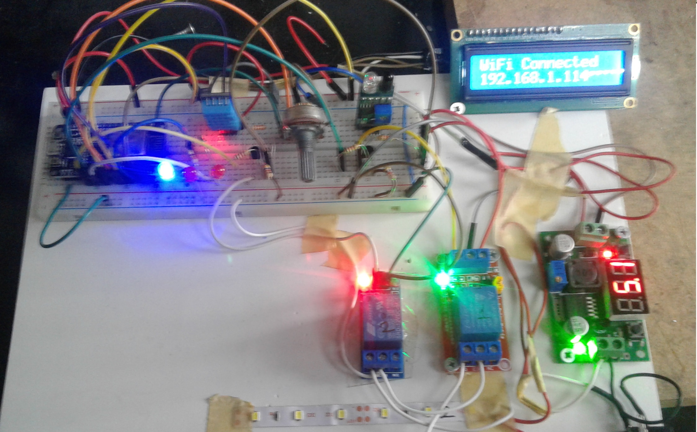
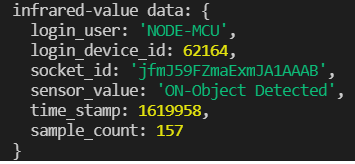
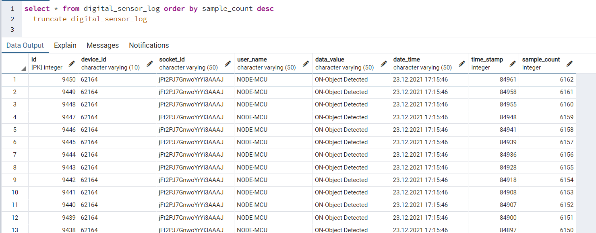
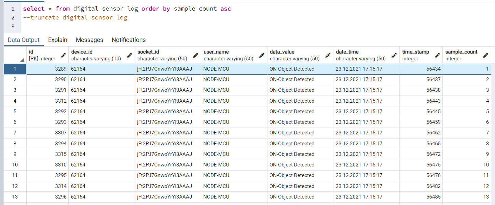
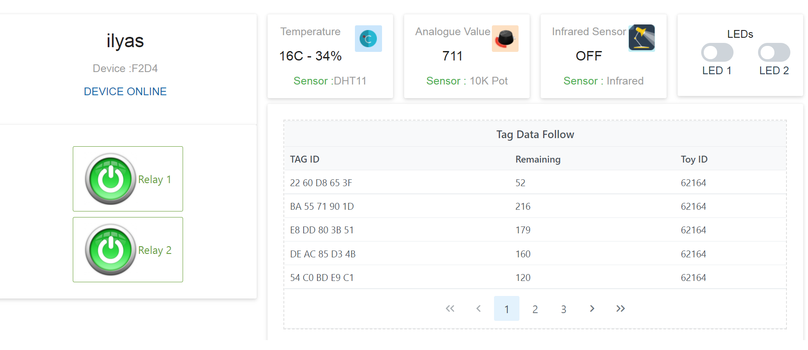
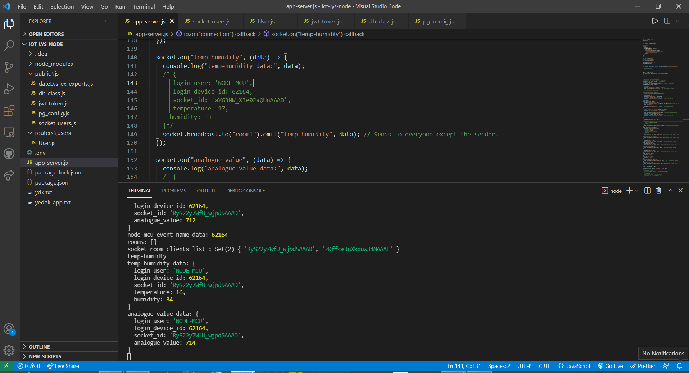
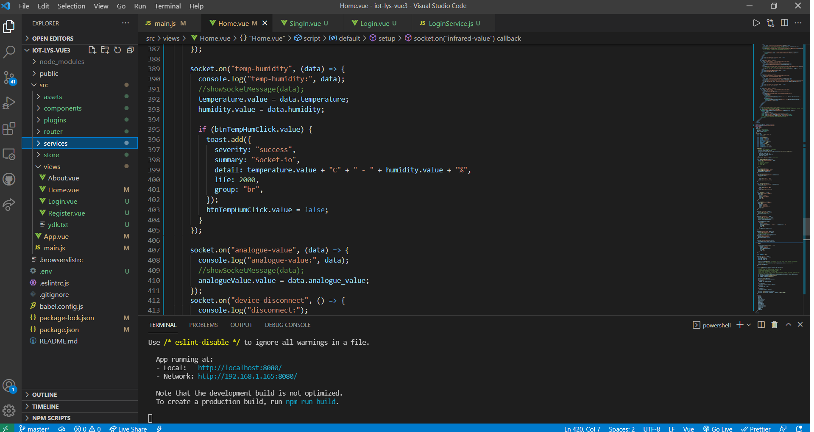

<h1 align="center">Socket io & Node JS & Vue3 Composition Api & Node MCU & PosgreSQL</h1>
<h1 align="center">Örnek IOT Çalışması</h1>


<h4 align="left">İÇERİK</h4>

- [Giriş](#Giriş)
- [Çalışma Şekli](#Çalışma-Şekli)
- [Kullanılan Teknolojiler](#Kullanılan-Teknolojiler)
- [İletişim](#İletişim)

## Giriş
<p  align="center">

</p>
Bu çalışmada test amaçlı olark bir IOT yapısı kurgulanmıştır.
Donanım kısımında;


- Node MCU ESP-12E
- DHT11 nem ve sıcaklık sensörü
- Infrared yaklaşım sensörü
- 10K pot
- 12V röle modülü
- Ledler

<p  align="center">

</p>

Server kısmında ;

- Node js Express
- Socket io versiyon 4

İstemci kısmında 

- Vue3 Composition Api

## Çalışma Şekli
Donanım sensörlerden aldığı bilgileri belirli peryotlarla server kısmına uygun olay isimleri ve verilerini ekleyerek gönderirken, yaklaşım sensöründen sinyal geldiği anda gönderme işlemini gerçekleştirir. Random olarak oluışturulan değerlerden oluşan bir veri seti de kurgulanmış ve belirli süre aralıklarıyla gönderilmiştir.

Donanım ve istemcinin (frontend) aynı odaya katılması sağlanmıştır. Server ikisi arasında köprü görevi görür. Socket io 'nun iki yönlü iletişim özelliği sayesinde istemci ve donanım tarafından olay tabanlı olarak gönderilen veriler anında işlenebilmiştir.

Yerelde çalışırken "cors" ile ilgili problemler yaşanmıştır. Server ve istemci tarafında koda gerekli eklemeler ve düzenlemeler yapılmıştır.

PostgreSql veri tabanına kullanıcılarla ve sensör dataları ile ilgili veriler yazılmış ve istemci tarafından bu veriler çekilerek gösterilmiştir. Böylece socket io ile beraber istemiciden gelen veri tabanı istekleri de gerçekleştirilmiştir.

### Test Çalışmaları
Testler yerel server ve bir gsm firmasının superbox adı verilen wifi modemi ile yapılmıştır.
Farklı modem modellerinde özellikle mesafe ile ilgili sonuçlar benzer olmayabilir.

### 1- Bağlantı Mesafesi
Donanım 12V bir aküye bağlanarak yaklaşık 900 metre kare ve kare şeklinde iki katlı, alt ve üst katta duvarlarla bölünmüş alanların ve kolonların  bulunduğu bir üretim atölyesinde dip noktalar dahil her noktaya ve bahçeye gidilerek bağlantı durumu gözlenmiştir.

Bu alanda bağlantının kopmadığı görülmüştür.  

Sonrasında ise dışarıya çıkılarak binadan  uzaklşılmış yaklaşık 50m mesafede bağlantının koptuğu gözlenmiştir. 

Yapılan saha çalışmasında cep telefonunun kablosuz modemi gördüğü her noktada iletişimin sağlandığı sonucuna varılmıştır. 
(Dikkat, cep telefonu modeline göre de değişiklik olabilir.)

### 2- Veri Gönderme Hızı

Socket io bağlantısına gönderilecek verilerin minumum zaman aralığındaki durumu tespit edilmeye çalışılmıştır. Burada amacımız iki veri arasındaki minumum zaman  ve bu veriler veri tabanına kaydedilirken veya gönderilirken bir kayıp oluyor mu tespit etmektir.

Bunun için Node mcu içersindeki yazılım düzenlemiş ve TESTING isimli bir sabit oluşturularak sistem test aşamasına alınmıştır. Infrared yakınlık sensörü kod yapısı teste göre düzenlenerek sensörün tetiklenmmesi ile veriler gönderilmiştir.. Veri yapısı şu şekildedir ;

<p  align="center">

</p>

Zaman damgası ve örnek data sayısı da eklenerek kayıp veri kontrolü yapılması sağlanmıştır. Node mcu sensör tetiklendiğinde sadece bu veriyi json formatına çevirerek göndermektedir. Gecikmeler işlemleri gerçekleştiren  fonksiyonların gecikmesidir.

Cihaz resetlenerek 30 saniye süre ile sensör tetiklenmiştir. Elde edilen sonuçlar şu şekildedir :

<p  align="center">


</p>

- Veri tabanına yazılan satır sayısı :6162
- Son veri zaman damgası: 84961 mS
- ilk veri zaman damgası: 56434 mS

- Buna göre :(81063-49767)/6162  =4.629 mS 

Yapılan incelemede verilerin hepsinin sıra atlamadan veri tabanınada yazıldığı görülmüştür.

### Bazı Ekran Görüntüleri
<br>
<p  align="center">


</p>
<br><br>
<p  align="center">


</p>

## Kullanılan Teknolojiler

```bash
- NOde MCU ESP-12E.
- Node js, Expres, socket io ...
- Vue3 Composition APi
- PostgreSQL

```

###  Örnek çalışma videosu :

<a href="https://youtu.be/AQEl6YUnvLM" target="_blank">
     
</a>


## İletişim

- GitHub [@your-ilyas9461](https://github.com/ilyas9461)
- Linkedin [@your-linkedin](https://www.linkedin.com/in/ilyas-yagcioglu/)
